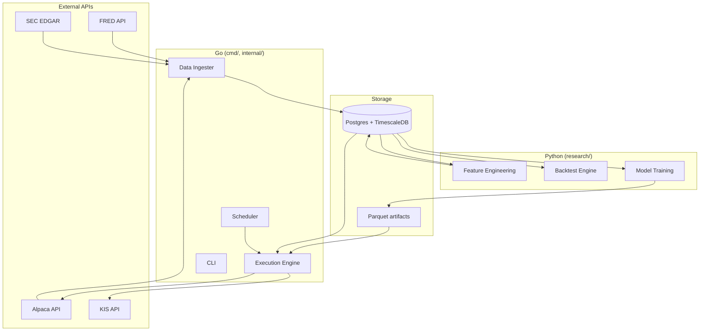
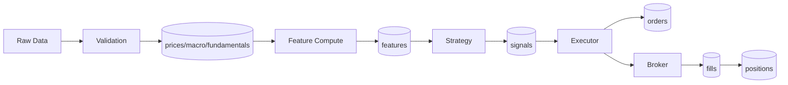

# Architecture

**최근 업데이트**: 2026-05-02 (Phase 0 spec 기반 초기화)

## 시스템 구성

Go와 Python은 직접 호출하지 않고 Postgres·Parquet·CLI 3가지 채널로만 통신한다 (R4).

## 핵심 설계 결정 (Architecture Rules)

상세 정의·근거는 [foundation spec §4](superpowers/specs/2026-05-02-foundation-design.md#4-핵심-설계-결정-architecture-rules) 참조. 본문 복사 금지 (drift 방지).

| 룰 | 1줄 요약 | 출처 spec |
|----|---------|----------|
| R1 | 모든 리스크 관리는 브로커 측 GTC 위임 (capability 강제) | [foundation §4](superpowers/specs/2026-05-02-foundation-design.md) |
| R2 | 상태는 무조건 DB, 인메모리 금지 (시작 시 reconciliation) | [foundation §4](superpowers/specs/2026-05-02-foundation-design.md) |
| R3 | 주문은 idempotent (deterministic client_order_id, Postgres sequence) | [foundation §4](superpowers/specs/2026-05-02-foundation-design.md) |
| R4 | Go ↔ Python 통신은 Postgres / Parquet / CLI 3채널만 | [foundation §4](superpowers/specs/2026-05-02-foundation-design.md) |
| R5 | 지표는 결정 규칙이 아닌 feature로만 도입 | [foundation §4](superpowers/specs/2026-05-02-foundation-design.md) |
| R6 | Feature catalog (`shared/contracts/features.md`)가 단일 진실 원천 | [foundation §4](superpowers/specs/2026-05-02-foundation-design.md) |
| R7 | Walk-forward 검증 안 거친 전략은 페이퍼도 금지 | [foundation §4](superpowers/specs/2026-05-02-foundation-design.md) |
| R8 | 페이퍼 12개월 + 정량 게이트 7종 + 사용자 명시 결정 시에만 라이브 전환 | [foundation §4](superpowers/specs/2026-05-02-foundation-design.md) |
| R9 | `shared/schema/`가 DB 스키마 단일 진실 (ORM auto-DDL 명시 금지) | [foundation §4](superpowers/specs/2026-05-02-foundation-design.md) |
| R10 | 빌드·테스트 독립성 (`go/`·`research/` 각자 단독 실행 가능) | [foundation §4](superpowers/specs/2026-05-02-foundation-design.md) |

## 데이터 흐름

## 통신 채널 명세

| 채널 | 용도 | 사용 예 | 금지 |
|------|------|--------|------|
| Postgres 테이블 | 운영 핫 패스 | 시그널/주문/포지션/가격/features | 임시 캐시 |
| Parquet 파일 | 배치 산출물 | 학습 모델, 시그널 스냅샷 | 운영 핫 패스 |
| CLI/HTTP | 운영 도구 | `go run cmd/cli/...`, 관리자 명령 | 운영 의사결정 |

## 컴포넌트 책임 분리

- **`go/`** — 데이터 인제스트, 주문 실행, 스케줄러, CLI. 운영 핫 패스 전담.
- **`research/`** — 백테스트, 팩터 연구, 모델 훈련, 분석 노트북. 비운영 경로.
- **`shared/`** — 양 언어가 공유하는 단일 진실 원천 (스키마, 계약, 산출물).
- **`docker/`** — 로컬 인프라 (Postgres + TimescaleDB).

## 업데이트 규칙

- 신규 룰(R11+) 추가는 본 문서 본문에 신규 섹션으로 추가
- 기존 룰 변경은 spec 개정 후 본 문서 요약 표만 갱신
- 새 컴포넌트나 통신 채널 추가 시 다이어그램 갱신 + 본 섹션의 책임 분리 표 갱신
- 기능 구현 완료 시 아키텍처에 영향 없으면 본 문서 갱신 불필요
