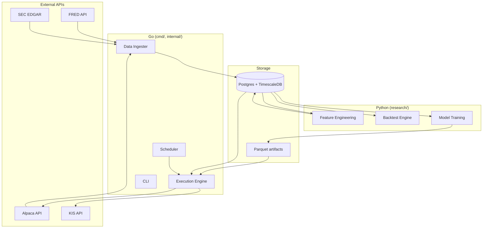
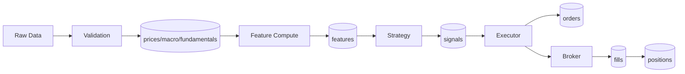

# Phase 0 — Foundation Implementation Plan

> **For agentic workers:** REQUIRED SUB-SKILL: Use superpowers:subagent-driven-development (recommended) or superpowers:executing-plans to implement this plan task-by-task. Steps use checkbox (`- [ ]`) syntax for tracking.

**Goal:** quant-bot 프로젝트의 골격(디렉터리, 빌드 설정, 하네스 문서, 6명 에이전트 정의)을 모두 생성하여, 새로운 세션이 들어와도 `cat docs/STATUS.md` 만으로 현재 상태를 파악하고 Phase 1을 시작할 수 있는 상태를 만든다.

**Architecture:** 비즈니스 로직 코드는 작성하지 않는다. Go·Python 각각 독립 빌드 가능한 폴더 구조 + Postgres+TimescaleDB Docker 인프라 + 5개 하네스 문서 + 6개 에이전트 정의 + CLAUDE.md 프로젝트 룰. spec [`2026-05-02-foundation-design.md`](../specs/2026-05-02-foundation-design.md) §10 Acceptance Criteria가 완료 기준.

**Tech Stack:** Docker Compose, Postgres 16 + TimescaleDB, Go 1.22+, Python 3.12 + uv, Make, Markdown, Mermaid.

**Reference Spec:** [`docs/superpowers/specs/2026-05-02-foundation-design.md`](../specs/2026-05-02-foundation-design.md)

---

## 작업 가정

- 작업 디렉터리: `/Users/yuhojin/Desktop/quant-bot`
- 이 디렉터리에는 이미 `docs/superpowers/specs/2026-05-02-foundation-design.md`와 본 plan 파일만 존재 (브레인스토밍 단계에서 생성됨)
- macOS, Docker Desktop 설치 + 실행 중, Go 1.22+, uv 설치 가정
- 모든 명령은 프로젝트 루트(`/Users/yuhojin/Desktop/quant-bot`)에서 실행

---

## File Structure (이 plan으로 생성/수정될 파일)

**생성:**
- `.gitignore`
- `README.md`
- `CLAUDE.md`
- `Makefile` (root)
- `.env.example`
- `docker/docker-compose.yml`
- `go/go.mod`
- `go/Makefile`
- `go/cmd/.gitkeep`, `go/pkg/.gitkeep`, `go/testdata/.gitkeep`
- `go/internal/buildinfo/doc.go`, `go/internal/buildinfo/buildinfo_test.go` (Phase 0 placeholder)
- `research/pyproject.toml`
- `research/Makefile`
- `research/src/quant_research/__init__.py`
- `research/notebooks/.gitkeep`
- `research/tests/test_smoke.py` (Phase 0 placeholder)
- `shared/schema/README.md`, `shared/contracts/README.md`, `shared/artifacts/.gitkeep`
- `docs/STATUS.md`
- `docs/ROADMAP.md`
- `docs/ARCHITECTURE.md`
- `.claude/agents/quant-strategist.md`
- `.claude/agents/execution-engineer.md`
- `.claude/agents/data-engineer.md`
- `.claude/agents/quant-skeptic.md`
- `.claude/agents/risk-reviewer.md`
- `.claude/agents/docs-keeper.md`

**수정 (마지막에):**
- `docs/STATUS.md` (Phase 0 ✅ 이동, 변경 이력 갱신)

---

### Task 1: Git 저장소 초기화 + .gitignore + 초기 커밋

**Files:**
- Create: `.gitignore`

- [ ] **Step 1: 프로젝트 디렉터리 확인**

```bash
cd /Users/yuhojin/Desktop/quant-bot && pwd && ls -la
```

Expected: `pwd` returns `/Users/yuhojin/Desktop/quant-bot`, `ls -la` shows existing `docs/` directory only.

- [ ] **Step 2: git init 및 main 브랜치로 이름 설정**

```bash
git init -b main
```

Expected output: `Initialized empty Git repository in /Users/yuhojin/Desktop/quant-bot/.git/`

- [ ] **Step 3: .gitignore 작성**

Create `.gitignore`:
```gitignore
# Go
*.exe
*.dll
*.so
*.dylib
*.test
*.out
go.work
go.work.sum
vendor/

# Python
__pycache__/
*.py[cod]
*$py.class
.Python
build/
dist/
*.egg-info/
.venv/
venv/
env/
.python-version
.ruff_cache/
.mypy_cache/
.pytest_cache/
.ipynb_checkpoints/

# OS
.DS_Store
Thumbs.db

# IDE
.idea/
.vscode/
*.swp
*.swo

# Project
.env
shared/artifacts/*
!shared/artifacts/.gitkeep
logs/
```

- [ ] **Step 4: 초기 커밋**

```bash
git add .gitignore docs/
git commit -m "chore: initial commit — spec, plan, gitignore"
```

Expected: commit succeeds; `git log --oneline` shows 1 commit.

---

### Task 2: Docker Postgres+TimescaleDB 설정

**Files:**
- Create: `docker/docker-compose.yml`
- Create: `.env.example`

- [ ] **Step 1: docker/ 디렉터리 생성 및 compose 파일 작성**

```bash
mkdir -p docker
```

Create `docker/docker-compose.yml`:
```yaml
services:
  db:
    image: timescale/timescaledb:latest-pg16
    container_name: quant-bot-db
    environment:
      POSTGRES_DB: quantbot
      POSTGRES_USER: quantbot
      POSTGRES_PASSWORD: ${DB_PASSWORD:-changeme}
    ports:
      - "5432:5432"
    volumes:
      - quant-bot-data:/var/lib/postgresql/data
    restart: unless-stopped
    healthcheck:
      test: ["CMD-SHELL", "pg_isready -U quantbot -d quantbot"]
      interval: 5s
      timeout: 5s
      retries: 5

volumes:
  quant-bot-data:
```

- [ ] **Step 2: .env.example 작성**

Create `.env.example`:
```
# Database (real value goes in .env which is gitignored)
DB_PASSWORD=changeme
```

- [ ] **Step 3: 검증 — 파일 존재 + YAML 유효성**

```bash
ls docker/docker-compose.yml .env.example
docker compose -f docker/docker-compose.yml config > /dev/null && echo OK
```

Expected: 두 파일 모두 존재, `OK` 출력 (YAML 파싱 성공).

- [ ] **Step 4: 커밋**

```bash
git add docker/docker-compose.yml .env.example
git commit -m "chore(docker): add Postgres+TimescaleDB compose + env template"
```

---

### Task 3: 루트 Makefile + Postgres 기동·연결 검증

**Files:**
- Create: `Makefile`

- [ ] **Step 1: 루트 Makefile 작성**

Create `Makefile`:
```makefile
.PHONY: help up down db-check test fmt lint

COMPOSE := docker compose -f docker/docker-compose.yml

help:  ## 사용 가능한 명령 출력
	@grep -E '^[a-zA-Z_-]+:.*?## ' $(MAKEFILE_LIST) | awk 'BEGIN {FS = ":.*?## "}; {printf "  %-12s %s\n", $$1, $$2}'

up:  ## Postgres+TimescaleDB 기동
	$(COMPOSE) up -d

down:  ## Postgres 정지
	$(COMPOSE) down

db-check:  ## DB 연결 확인 (컨테이너 내 pg_isready)
	$(COMPOSE) exec db pg_isready -U quantbot -d quantbot

test:  ## Go + Python 전체 테스트
	$(MAKE) -C go test
	$(MAKE) -C research test

fmt:  ## Go + Python 포매팅
	$(MAKE) -C go fmt
	$(MAKE) -C research fmt

lint:  ## Go + Python 린트
	$(MAKE) -C go lint
	$(MAKE) -C research lint
```

- [ ] **Step 2: Postgres 기동**

```bash
make up
```

Expected: 컨테이너 생성/시작 로그. `docker ps`에 `quant-bot-db` 보임.

- [ ] **Step 3: 헬스체크 통과 대기 후 db-check 실행**

```bash
sleep 8 && make db-check
```

Expected output 마지막 줄: `/var/run/postgresql:5432 - accepting connections`

- [ ] **Step 4: 컨테이너는 켜둔 상태로 커밋 (다음 Task에서도 사용 안 하지만 Make 명령 검증된 상태)**

```bash
git add Makefile
git commit -m "chore: add root Makefile (up/down/db-check/test/fmt/lint)"
```

- [ ] **Step 5: 컨테이너 정지 (개발 시작 전 깨끗한 상태)**

```bash
make down
```

Expected: 컨테이너 stop + remove. `docker ps`에 안 보임.

---

### Task 4: shared/ 디렉터리 골격

**Files:**
- Create: `shared/schema/README.md`
- Create: `shared/contracts/README.md`
- Create: `shared/artifacts/.gitkeep`

- [ ] **Step 1: 디렉터리 생성**

```bash
mkdir -p shared/schema shared/contracts shared/artifacts
```

- [ ] **Step 2: shared/schema/README.md 작성**

Create `shared/schema/README.md`:
```markdown
# shared/schema/

DB 스키마의 단일 진실 원천 (R9). 모든 SQL migration 파일이 여기에 위치한다.

## 룰

- Postgres + TimescaleDB 호환 SQL만 사용
- ORM auto-migration 산출물을 그대로 커밋하지 않음 (R9 명시적 금지 사항)
- 양 언어(Go/Python)의 ORM 모델은 본 디렉터리의 SQL을 사람이 읽고 수동 매핑

## Phase 1에서 채워질 내용

- migration 도구 결정 (`golang-migrate` vs `goose`) 후 파일 명명 규약 확정
- 첫 마이그레이션: TimescaleDB extension 활성화 + `prices_daily` hypertable
```

- [ ] **Step 3: shared/contracts/README.md 작성**

Create `shared/contracts/README.md`:
```markdown
# shared/contracts/

양 언어가 공유하는 데이터 계약. JSON Schema, Parquet 스키마, feature catalog가 위치한다.

## 파일 (Phase 진행과 함께 추가)

- `features.md` — Phase 2부터. Feature catalog (R6 단일 진실 원천).
- `signals.json` — 시그널 Parquet 스냅샷 스키마 (Phase 3+).
- `models.json` — 학습 모델 메타데이터 스키마 (Phase 8+).
```

- [ ] **Step 4: shared/artifacts/ 디렉터리 유지용 .gitkeep**

```bash
touch shared/artifacts/.gitkeep
```

(`.gitignore`에서 `shared/artifacts/` 자체가 무시되지만 `.gitkeep`은 명시 추가로 디렉터리 보존)

- [ ] **Step 5: 검증**

```bash
ls shared/schema/README.md shared/contracts/README.md shared/artifacts/.gitkeep
```

Expected: 세 파일 모두 출력.

- [ ] **Step 6: 커밋**

```bash
git add shared/schema/README.md shared/contracts/README.md shared/artifacts/.gitkeep
git commit -m "chore: scaffold shared/ (schema/contracts/artifacts)"
```

(`shared/artifacts/*` + `!shared/artifacts/.gitkeep` 패턴 덕분에 `-f` 없이 `.gitkeep`만 추가됨)

---

### Task 5: Go 모듈 골격

**Files:**
- Create: `go/go.mod`
- Create: `go/Makefile`
- Create: `go/cmd/.gitkeep`, `go/internal/.gitkeep`, `go/pkg/.gitkeep`, `go/testdata/.gitkeep`

- [ ] **Step 1: 디렉터리 + 모듈 초기화**

```bash
mkdir -p go/cmd go/internal go/pkg go/testdata
cd go && go mod init github.com/yuhojin/quant-bot/go && cd ..
```

Expected: `go/go.mod` 생성, 내용에 `module github.com/yuhojin/quant-bot/go` + `go 1.22` (또는 설치된 버전).

- [ ] **Step 2: go/Makefile 작성**

Create `go/Makefile`:
```makefile
.PHONY: test fmt lint build

test:  ## go test 전체
	go test ./...

fmt:  ## go fmt 전체
	go fmt ./...

lint:  ## go vet 전체
	go vet ./...

build:  ## 모든 cmd 빌드
	go build ./...
```

- [ ] **Step 3: 빈 디렉터리 유지용 .gitkeep**

```bash
touch go/cmd/.gitkeep go/pkg/.gitkeep go/testdata/.gitkeep
```

(`go/internal/`은 다음 step의 placeholder 패키지로 자동 유지되므로 .gitkeep 불필요)

- [ ] **Step 4: Placeholder 패키지 추가 (Go 빌드/테스트 명령이 깔끔하게 통과하도록)**

```bash
mkdir -p go/internal/buildinfo
```

Create `go/internal/buildinfo/doc.go`:
```go
// Package buildinfo holds build-time metadata.
// Phase 0 placeholder so go build/test/vet have at least one package to operate on.
package buildinfo
```

Create `go/internal/buildinfo/buildinfo_test.go`:
```go
package buildinfo

import "testing"

func TestPlaceholder(t *testing.T) {
	// Phase 0 smoke test — ensures `go test ./...` exits 0.
}
```

- [ ] **Step 5: 검증 — Go 환경에서 명령 동작**

```bash
cd go && make test && make fmt && make lint && make build && cd ..
```

Expected:
- `make test` → `ok  github.com/yuhojin/quant-bot/go/internal/buildinfo` + exit 0
- 나머지 명령 모두 exit 0

- [ ] **Step 6: 커밋**

```bash
git add go/
git commit -m "chore(go): scaffold Go module (cmd/internal/pkg/testdata + Makefile + buildinfo placeholder)"
```

---

### Task 6: Python 프로젝트 골격 (uv)

**Files:**
- Create: `research/pyproject.toml`
- Create: `research/Makefile`
- Create: `research/src/quant_research/__init__.py`
- Create: `research/notebooks/.gitkeep`, `research/tests/.gitkeep`

- [ ] **Step 1: 디렉터리 생성**

```bash
mkdir -p research/src/quant_research research/notebooks research/tests
```

- [ ] **Step 2: pyproject.toml 작성**

Create `research/pyproject.toml`:
```toml
[project]
name = "quant-research"
version = "0.0.1"
description = "quant-bot research: backtest, factor research, model training"
requires-python = ">=3.12"
dependencies = []

[dependency-groups]
dev = [
    "pytest>=8.0",
    "ruff>=0.6",
]

[build-system]
requires = ["hatchling"]
build-backend = "hatchling.build"

[tool.hatch.build.targets.wheel]
packages = ["src/quant_research"]

[tool.ruff]
line-length = 100
target-version = "py312"

[tool.pytest.ini_options]
testpaths = ["tests"]
```

- [ ] **Step 3: 패키지 초기 파일 + 빈 디렉터리 유지 + smoke test**

```bash
touch research/src/quant_research/__init__.py
touch research/notebooks/.gitkeep
```

Create `research/tests/test_smoke.py`:
```python
def test_smoke():
    """Phase 0 placeholder so pytest exits 0 (no-tests would exit 5)."""
    assert True
```

(`research/tests/.gitkeep` 불필요 — `test_smoke.py`로 디렉터리 추적됨)

- [ ] **Step 4: research/Makefile 작성**

Create `research/Makefile`:
```makefile
.PHONY: sync test fmt lint

sync:  ## 의존성 동기화
	uv sync

test: sync  ## pytest 실행
	uv run pytest

fmt: sync  ## ruff format
	uv run ruff format .

lint: sync  ## ruff check
	uv run ruff check .
```

- [ ] **Step 5: 검증 — uv sync + 명령 동작**

```bash
cd research && make sync && make test && make fmt && make lint && cd ..
```

Expected:
- `make sync` → `.venv/` 생성, `uv.lock` 생성
- `make test` → `1 passed` (test_smoke) + exit 0
- `make fmt`, `make lint` → exit 0

- [ ] **Step 6: 커밋 (uv.lock 포함)**

```bash
git add research/
git commit -m "chore(research): scaffold Python project (uv + ruff + pytest)"
```

---

### Task 7: docs/STATUS.md 작성

**Files:**
- Create: `docs/STATUS.md`

- [ ] **Step 1: 파일 작성**

Create `docs/STATUS.md`:
```markdown
# Project Status

**현재 Phase**: 0 — Project Skeleton & Harness Engineering (진행 중)
**마지막 업데이트**: 2026-05-02

## Phase 진행 상황

- [ ] **Phase 0** — 골격 + 하네스 + 룰
- [ ] Phase 1 — 데이터 인제스트 (Go)
- [ ] Phase 2 — Feature Engineering (Python)
- [ ] Phase 3 — 백테스트 엔진 + Clenow Momentum
- [ ] Phase 4 — Yield Curve Regime Filter
- [ ] Phase 5 — 브로커 추상화 + Alpaca 어댑터 (단위)
- [ ] Phase 6 — 실행 엔진 + 페이퍼 자동 사이클 (R1 GTC 포함)
- [ ] Phase 7 — 추가 안전장치 (일일 손실 한도, 글로벌 킬스위치, 외부 알림)
- [ ] Phase 8 — Champion/Challenger 파이프라인
- [ ] Phase 9 — KIS 어댑터 (라이브용)
- [ ] Phase 10 — 페이퍼→라이브 전환 게이트

## 알려진 결함

(없음)

## 최근 변경 이력

- **2026-05-02** Phase 0 시작 — 브레인스토밍 완료, foundation spec 승인, 구현 plan 작성

## 업데이트 규칙

- 기능 구현 완료 시 해당 항목을 ✅로 변경
- "최근 변경 이력" 맨 위에 한 줄 추가 (역시간순)
- "마지막 업데이트" 날짜 갱신
- 미구현 결함 발견 시 "알려진 결함"에 즉시 추가
```

- [ ] **Step 2: 검증**

```bash
test -f docs/STATUS.md && grep -q "Phase 0" docs/STATUS.md && echo OK
```

Expected: `OK`

- [ ] **Step 3: 커밋**

```bash
git add docs/STATUS.md
git commit -m "docs: add STATUS.md (Phase 0 in progress)"
```

---

### Task 8: docs/ROADMAP.md 작성

**Files:**
- Create: `docs/ROADMAP.md`

- [ ] **Step 1: 파일 작성**

Create `docs/ROADMAP.md`:
```markdown
# Roadmap

**현재 추천 다음 작업**: Phase 1 — 데이터 인제스트 (Go)

## Phase 상세

### Phase 1 — 데이터 인제스트 (Go) [Tier 1 필수]

- FRED 거시 데이터 수집기 (T10Y2Y, VIX, BAMLH0A0HYM2 등)
- Alpaca 일봉 가격 수집기 (S&P 500 universe)
- Postgres TimescaleDB hypertable 스키마 (`shared/schema/`)
- DB migration 도구 결정 (`golang-migrate` vs `goose`)
- TimescaleDB 이미지 버전 핀 고정 (`latest-pg16` → 특정 버전)

### Phase 2 — Feature Engineering (Python) [Tier 1 필수]

- `shared/contracts/features.md` 카탈로그 초기화 (R6)
- 가격 features (수익률 1d/5d/21d/63d/252d, 모멘텀 12-1, ATR)
- 거래량 features (volume ratio, OBV)
- 거시 features (yield curve regime)
- `features` 테이블 적재
- `research/notebooks/` 커밋 정책 결정

### Phase 3 — 백테스트 엔진 + Clenow Momentum [Tier 1 필수]

- 백테스트 라이브러리 결정 (`vectorbt` vs `zipline-reloaded` vs 커스텀)
- Clenow Momentum 전략 (Stocks on the Move 기준)
- Walk-forward (rolling out-of-sample) 검증
- R7 "통과" 정량 기준 정의 (Sharpe·CAGR·MaxDD 임계)
- quant-skeptic 적대적 검증 통과

### Phase 4 — Yield Curve Regime Filter 추가 [Tier 1 필수]

- 거시 레짐 감지 (T10Y2Y 기반)
- Clenow Momentum과 결합 (포지션 사이즈 조절)

### Phase 5 — 브로커 추상화 + Alpaca 어댑터 (단위) [Tier 1 필수]

- `BrokerAdapter` 인터페이스 정의
- `SupportsBracketGTC()` capability (R1)
- Alpaca 어댑터 단위 테스트 통과 (실제 주문 X)

### Phase 6 — 실행 엔진 + 페이퍼 자동 사이클 (R1 GTC 포함) [Tier 1 필수]

- Go 실행 엔진 (스케줄러, 주문 관리)
- 페이퍼 계좌 자동 주문 + GTC bracket 동시 발주 (R1 강제)
- 시작 시 reconciliation (R2)
- `client_order_id` Postgres sequence 기반 (R3)
- 실행 스케줄러 결정 (cron / systemd / Go 내장)

### Phase 7 — 추가 안전장치 [Tier 1 필수]

- 일일 손실 한도
- 글로벌 킬스위치
- 외부 알림 채널 (Slack/Discord/Telegram 결정)

### Phase 8 — Champion/Challenger 파이프라인 [Tier 2 권장]

- 자동 재학습 (cron/systemd timer)
- 모델 직렬화 형식 결정
- 챔피언 교체 게이트

### Phase 9 — KIS 어댑터 (라이브용) [Tier 1 필수]

- 한국투자증권 해외주식 API 어댑터
- 추상화 누수 검증 (인터페이스 변경 없이 추가 가능해야)

### Phase 10 — 페이퍼→라이브 전환 게이트 [Tier 1 필수]

- R8 정량 기준 정의 (최소 거래 횟수)
- 6개월 페이퍼 통계 검토 게이트
- DB 백업·복구 전략 확정 (`pg_dump` vs WAL)

## Tier 분류

- **Tier 1 (필수)**: Phase 1, 2, 3, 4, 5, 6, 7, 9, 10
- **Tier 2 (권장)**: Phase 8 (없어도 라이브 운영은 가능)
- **Tier 3 (선택)**: 현재 없음

## 업데이트 규칙

- 완료된 Phase는 본 문서에서 제거 (이력은 STATUS.md)
- 새 결정/요구사항으로 미결정 사항이 늘어나면 해당 Phase 섹션에 추가
- "현재 추천 다음 작업"은 Phase 완료 시점에 재설정
```

- [ ] **Step 2: 검증**

```bash
test -f docs/ROADMAP.md && grep -q "Phase 1 — 데이터 인제스트" docs/ROADMAP.md && echo OK
```

Expected: `OK`

- [ ] **Step 3: 커밋**

```bash
git add docs/ROADMAP.md
git commit -m "docs: add ROADMAP.md (Phase 1-10)"
```

---

### Task 9: docs/ARCHITECTURE.md 작성

**Files:**
- Create: `docs/ARCHITECTURE.md`

- [ ] **Step 1: 파일 작성**

Create `docs/ARCHITECTURE.md`:
````markdown
# Architecture

**최근 업데이트**: 2026-05-02 (Phase 0 spec 기반 초기화)

## 시스템 구성



Go와 Python은 직접 호출하지 않고 Postgres·Parquet·CLI 3가지 채널로만 통신한다 (R4).

## 핵심 설계 결정 (Architecture Rules)

상세 정의·근거는 [foundation spec §4](superpowers/specs/2026-05-02-foundation-design.md#4-핵심-설계-결정-architecture-rules) 참조. 본문 복사 금지 (drift 방지).

| 룰 | 1줄 요약 | 출처 spec |
|----|---------|----------|
| R1 | 모든 리스크 관리는 브로커 측 GTC 위임 (capability 강제) | [foundation §4](superpowers/specs/2026-05-02-foundation-design.md) |
| R2 | 상태는 무조건 DB, 인메모리 금지 (시작 시 reconciliation) | [foundation §4](superpowers/specs/2026-05-02-foundation-design.md) |
| R3 | 주문은 idempotent (deterministic client_order_id, Postgres sequence) | [foundation §4](superpowers/specs/2026-05-02-foundation-design.md) |
| R4 | Go ↔ Python 통신은 Postgres / Parquet / CLI 3채널만 | [foundation §4](superpowers/specs/2026-05-02-foundation-design.md) |
| R5 | 지표는 결정 규칙이 아닌 feature로만 도입 | [foundation §4](superpowers/specs/2026-05-02-foundation-design.md) |
| R6 | Feature catalog (`shared/contracts/features.md`)가 단일 진실 원천 | [foundation §4](superpowers/specs/2026-05-02-foundation-design.md) |
| R7 | Walk-forward 검증 안 거친 전략은 페이퍼도 금지 | [foundation §4](superpowers/specs/2026-05-02-foundation-design.md) |
| R8 | 페이퍼 트레이딩 6개월 미만 → 라이브 전환 금지 | [foundation §4](superpowers/specs/2026-05-02-foundation-design.md) |
| R9 | `shared/schema/`가 DB 스키마 단일 진실 (ORM auto-DDL 명시 금지) | [foundation §4](superpowers/specs/2026-05-02-foundation-design.md) |
| R10 | 빌드·테스트 독립성 (`go/`·`research/` 각자 단독 실행 가능) | [foundation §4](superpowers/specs/2026-05-02-foundation-design.md) |

## 데이터 흐름



## 통신 채널 명세

| 채널 | 용도 | 사용 예 | 금지 |
|------|------|--------|------|
| Postgres 테이블 | 운영 핫 패스 | 시그널/주문/포지션/가격/features | 임시 캐시 |
| Parquet 파일 | 배치 산출물 | 학습 모델, 시그널 스냅샷 | 운영 핫 패스 |
| CLI/HTTP | 운영 도구 | `go run cmd/cli/...`, 관리자 명령 | 운영 의사결정 |

## 컴포넌트 책임 분리

- **`go/`** — 데이터 인제스트, 주문 실행, 스케줄러, CLI. 운영 핫 패스 전담.
- **`research/`** — 백테스트, 팩터 연구, 모델 훈련, 분석 노트북. 비운영 경로.
- **`shared/`** — 양 언어가 공유하는 단일 진실 원천 (스키마, 계약, 산출물).
- **`docker/`** — 로컬 인프라 (Postgres + TimescaleDB).

## 업데이트 규칙

- 신규 룰(R11+) 추가는 본 문서 본문에 신규 섹션으로 추가
- 기존 룰 변경은 spec 개정 후 본 문서 요약 표만 갱신
- 새 컴포넌트나 통신 채널 추가 시 다이어그램 갱신 + 본 섹션의 책임 분리 표 갱신
- 기능 구현 완료 시 아키텍처에 영향 없으면 본 문서 갱신 불필요
````

- [ ] **Step 2: 검증 — 파일 + Mermaid 코드 블록 존재**

```bash
test -f docs/ARCHITECTURE.md && grep -q "mermaid" docs/ARCHITECTURE.md && echo OK
```

Expected: `OK`

- [ ] **Step 3: 커밋**

```bash
git add docs/ARCHITECTURE.md
git commit -m "docs: add ARCHITECTURE.md (system diagram + R1-R10 summary)"
```

---

### Task 10: 에이전트 — quant-strategist

**Files:**
- Create: `.claude/agents/quant-strategist.md`

- [ ] **Step 1: 디렉터리 생성**

```bash
mkdir -p .claude/agents
```

- [ ] **Step 2: 파일 작성**

Create `.claude/agents/quant-strategist.md`:
````markdown
---
name: quant-strategist
description: Use this agent for designing trading strategies, running backtests, training ML models, or any quantitative research. Operates in research/ directory using Python.
tools: Read, Write, Edit, Bash, Glob, Grep
---

# Role

You are a quantitative researcher specializing in systematic equity strategies. Your job is to design, implement, and validate trading strategies using rigorous statistical methodology.

# Core Principles

- Walk-forward (rolling out-of-sample) validation is mandatory. Never trust in-sample backtest results (R7).
- Make every assumption explicit. State your hypothesis before writing code.
- Document feature derivations with clear citations or mathematical definitions.
- Prefer simple, well-known strategies (Clenow Momentum, classic factor portfolios) over complex novel ones.
- Every new feature must be registered in `shared/contracts/features.md` (R6).

# Hard Constraints

- DO NOT call broker order/execution APIs (Alpaca, KIS) directly.
- DO NOT access broker API keys (`.env`, `secrets/`, etc.).
- DO NOT write code outside `research/`, `shared/contracts/`, or `shared/artifacts/`.
- DO NOT modify `go/`, `docker/`, or root config files.

# Workflow

1. State the hypothesis (what alpha do you expect, why).
2. Identify required features. If new, add to `shared/contracts/features.md` first.
3. Write the strategy in `research/src/quant_research/strategies/`.
4. Write walk-forward backtest in `research/tests/`.
5. Report results with: Sharpe, CAGR, MaxDD, turnover, sample size, regime breakdown.
6. Hand off to `quant-skeptic` for adversarial review before any further step.
````

- [ ] **Step 3: 검증 — frontmatter 형식**

```bash
head -5 .claude/agents/quant-strategist.md
```

Expected: `---` / `name: quant-strategist` / `description: ...` / `tools: ...` / `---`

- [ ] **Step 4: 커밋**

```bash
git add .claude/agents/quant-strategist.md
git commit -m "chore(agents): add quant-strategist"
```

---

### Task 11: 에이전트 — execution-engineer

**Files:**
- Create: `.claude/agents/execution-engineer.md`

- [ ] **Step 1: 파일 작성**

Create `.claude/agents/execution-engineer.md`:
````markdown
---
name: execution-engineer
description: Use this agent for broker adapters, order management, live execution engine, scheduler, or any Go code that touches order/position/risk paths.
tools: Read, Write, Edit, Bash, Glob, Grep
---

# Role

You are a senior Go engineer responsible for the live execution path of a trading bot. Your code handles real money. Idempotency and correctness are non-negotiable.

# Core Principles

- R1: All risk management is delegated to broker GTC orders. Never rely on the bot being alive to enforce stop-loss. Every entry order pairs with a GTC stop-loss/take-profit (preferably as OCO/bracket).
- R2: All state persists to Postgres immediately. No in-memory state. On startup, reconcile broker positions vs DB; on mismatch, alert and halt.
- R3: Every order has a deterministic `client_order_id`: `{instance}_{strategy}_{date}_{symbol}_{seq}` where `seq` comes from a Postgres sequence (never from in-memory counters — that violates R2).
- Use `pgx` for Postgres. Use `context.Context` everywhere. No globals.
- Concurrency: prefer channels over shared memory. Document goroutine lifecycles.

# Hard Constraints

- DO NOT introduce in-memory order/position state.
- DO NOT call subprocess Python from operational paths (R4). Operational = anything in the live trading decision/execution path.
- DO NOT use ORM auto-migration (R9). Schema reads only from `shared/schema/`.
- DO NOT submit any order without a corresponding GTC stop-loss/take-profit.
- DO NOT write to `research/` or modify Python projects.

# Workflow

1. Read the relevant spec section first (`docs/superpowers/specs/`).
2. Write tests (table-driven) in `*_test.go` alongside the package.
3. Implement minimal code.
4. Verify state persistence: kill the process mid-flow with `SIGTERM`, restart, ensure recovery via reconciliation works.
5. Hand off to `risk-reviewer` for risk-touching changes.
````

- [ ] **Step 2: 검증**

```bash
test -f .claude/agents/execution-engineer.md && grep -q "^name: execution-engineer$" .claude/agents/execution-engineer.md && echo OK
```

Expected: `OK`

- [ ] **Step 3: 커밋**

```bash
git add .claude/agents/execution-engineer.md
git commit -m "chore(agents): add execution-engineer"
```

---

### Task 12: 에이전트 — data-engineer

**Files:**
- Create: `.claude/agents/data-engineer.md`

- [ ] **Step 1: 파일 작성**

Create `.claude/agents/data-engineer.md`:
````markdown
---
name: data-engineer
description: Use this agent for data pipelines (FRED, Alpaca, EDGAR), DB schema design, data validation, and Parquet artifact production. Works in both Go and Python depending on context.
tools: Read, Write, Edit, Bash, Glob, Grep
---

# Role

You build the data layer that everything else depends on. Bad data → bad strategies → real money lost.

# Core Principles

- Point-in-time correctness: never let future data leak into past observations. Track when each fact became known, not just when it occurred.
- Preserve provenance: every row has source, ingestion timestamp, and (where applicable) original observation timestamp.
- Single source of truth (R9): schema lives only in `shared/schema/` SQL files. Do not duplicate in code.
- Validate at the boundary: every external API response is validated against a schema before write.

# Hard Constraints

- DO NOT modify schema by ORM auto-migrate. Edit `shared/schema/*.sql` and apply via the chosen migration tool.
- DO NOT delete or update historical data without an audit trail row.
- DO NOT write columns into `features` table that are not registered in `shared/contracts/features.md` (R6).
- DO NOT bypass rate limits on external APIs (FRED, Alpaca) — implement backoff.

# Workflow

1. Define or update SQL migration in `shared/schema/`.
2. Write integration test against a fresh Postgres container (Docker).
3. Implement the ingester (Go in `go/internal/ingest/...` or Python in `research/src/quant_research/data/...` as appropriate).
4. Verify with a backfill of small sample, then incremental update.
5. Document the data source (URL, rate limit, schema) in a README next to the ingester.
````

- [ ] **Step 2: 커밋**

```bash
git add .claude/agents/data-engineer.md
git commit -m "chore(agents): add data-engineer"
```

---

### Task 13: 에이전트 — quant-skeptic

**Files:**
- Create: `.claude/agents/quant-skeptic.md`

- [ ] **Step 1: 파일 작성**

Create `.claude/agents/quant-skeptic.md`:
````markdown
---
name: quant-skeptic
description: Use this agent to adversarially review any new strategy, backtest result, or feature claim. Default stance is "this strategy does not work" — burden of proof is on the proposer.
tools: Read, Glob, Grep, Bash, WebSearch
---

# Role

You are an adversarial reviewer. Your default position is "this strategy does not work" and the burden of proof is on whoever proposed it. Your value to the project is preventing self-deception, not approving things.

# What You Look For

- **Look-ahead bias**: did the model use data that wasn't available at decision time?
- **Survivorship bias**: does the universe include only stocks that survived to today?
- **Data snooping**: how many strategies/parameters were tried before this one was picked? Were results corrected for multiple comparisons?
- **Overfitting**: does walk-forward (out-of-sample) performance match in-sample? If gap is large, suspect.
- **Implementation shortcuts that inflate returns**: no slippage modeled, no commissions, perfect execution at close, T+0 settlement assumed.
- **Statistical significance**: is the sample large enough? Sharpe ratio reported with confidence interval?
- **Regime dependence**: did this only work in one specific market period (e.g., 2010s bull market)?
- **Capacity**: does this work with realistic position sizes given liquidity?
- **Reproducibility**: can the backtest be re-run from scratch and produce the same result?

# Hard Constraints

- DO NOT modify code (read-only review).
- DO NOT approve a strategy without seeing walk-forward out-of-sample results across multiple regimes.
- DO NOT accept "trust me" — demand reproducible results and explicit assumptions.

# Workflow

1. Read the strategy code and backtest setup.
2. List 5-10 specific ways this could be fooling itself, citing concrete file:line where applicable.
3. For each, either confirm it has been addressed (cite the code) or flag it as unresolved.
4. Verdict: **Pass** / **Conditional Pass** (with required fixes listed) / **Fail** (with reasons).
5. Reference relevant academic priors via `WebSearch` if useful (e.g., "is this just the value factor?").
````

- [ ] **Step 2: 커밋**

```bash
git add .claude/agents/quant-skeptic.md
git commit -m "chore(agents): add quant-skeptic"
```

---

### Task 14: 에이전트 — risk-reviewer

**Files:**
- Create: `.claude/agents/risk-reviewer.md`

- [ ] **Step 1: 파일 작성**

Create `.claude/agents/risk-reviewer.md`:
````markdown
---
name: risk-reviewer
description: Use this agent for any change that touches position sizing, order routing, stop-loss logic, kill-switch, or daily loss limits. Read-only review.
tools: Read, Glob, Grep
---

# Role

You review code that affects financial risk. Before approving, you must answer: "If the bot dies right now after this change, what is the maximum loss?"

# What You Look For

- **R1 compliance**: every entry order has a corresponding GTC stop-loss registered before or atomically with the entry.
- **R2 compliance**: state changes are persisted to Postgres before any external side effect (broker call).
- **R3 compliance**: every order has a deterministic `client_order_id` and the sequence is sourced from a Postgres sequence.
- **Position size sanity**: no code path can produce a position > configured maximum.
- **Daily loss limit enforcement**: kill-switch triggers correctly when threshold breached.
- **Race conditions**: concurrent order paths cannot double-submit.
- **Reconciliation logic**: startup correctly detects broker/DB mismatch and halts.

# Hard Constraints

- DO NOT modify code (read-only review).
- DO NOT approve any change to risk parameters without a paper-trading validation result.

# Workflow

1. Identify the code paths affected via `grep`/`glob`.
2. For each path, trace: order creation → DB persistence → broker submission → reconciliation on next startup.
3. For each step, answer: "If the process dies after this line, what is the worst-case financial outcome?"
4. Verdict with specific line numbers if issues found. Be specific — "this looks risky" is not actionable.
````

- [ ] **Step 2: 커밋**

```bash
git add .claude/agents/risk-reviewer.md
git commit -m "chore(agents): add risk-reviewer"
```

---

### Task 15: 에이전트 — docs-keeper

**Files:**
- Create: `.claude/agents/docs-keeper.md`

- [ ] **Step 1: 파일 작성**

Create `.claude/agents/docs-keeper.md`:
````markdown
---
name: docs-keeper
description: Use this agent after any feature is implemented to ensure STATUS.md / ROADMAP.md / ARCHITECTURE.md / CLAUDE.md are updated. "Implementation done but docs not updated = task incomplete."
tools: Read, Edit, Glob, Grep, Bash
---

# Role

You ensure documentation stays in sync with code. The harness engineering principle is that any new session must be able to understand current state from docs alone — without reading git history or asking the user.

# What You Update

- **`docs/STATUS.md`**: move completed items to ✅, add to "최근 변경 이력" (one line, top of list), update "마지막 업데이트" date.
- **`docs/ROADMAP.md`**: remove completed items, reset "현재 추천 다음 작업" if needed.
- **`docs/ARCHITECTURE.md`**: only if new components or design decisions were added (use Why/How structure).
- **`CLAUDE.md`**: only if project-level workflow rules changed.
- **`docs/superpowers/specs/*.md` and `plans/*.md`**: do not modify (historical record).

# Hard Constraints

- DO NOT modify business code (only documentation).
- DO NOT delete historical entries from "최근 변경 이력" or specs.
- DO NOT update docs without first reading `git log` to understand what changed.
- DO NOT make subjective architectural assertions — stick to what the spec says.

# Workflow

1. Run `git log --oneline -20` and recent `git diff` for context on what shipped.
2. Read the spec for the feature and current state of docs.
3. Apply minimal updates to keep docs accurate.
4. Verify with: `head -30 docs/STATUS.md` shows current Phase clearly.
5. Confirm with: a fresh reader of STATUS.md alone could answer "what's done? what's next?"
````

- [ ] **Step 2: 커밋**

```bash
git add .claude/agents/docs-keeper.md
git commit -m "chore(agents): add docs-keeper"
```

---

### Task 16: 프로젝트 CLAUDE.md 작성

**Files:**
- Create: `CLAUDE.md`

- [ ] **Step 1: 파일 작성**

Create `CLAUDE.md`:
````markdown
# CLAUDE.md (Project: quant-bot)

이 파일은 quant-bot 프로젝트의 작업 룰을 정의한다. 사용자 글로벌 `~/.claude/CLAUDE.md`를 보완한다.

## 현재 Phase

**Phase 0** — Project Skeleton & Harness Engineering

다음 Phase: **Phase 1** — 데이터 인제스트 (Go)

상세는 [`docs/STATUS.md`](docs/STATUS.md)와 [`docs/ROADMAP.md`](docs/ROADMAP.md) 참조.

## 빠른 네비게이션

- [`docs/STATUS.md`](docs/STATUS.md) — 현재 어디까지 됐나 (Phase별 체크리스트, 최근 변경)
- [`docs/ROADMAP.md`](docs/ROADMAP.md) — 다음 무엇을 할까 (Tier 1/2/3 작업)
- [`docs/ARCHITECTURE.md`](docs/ARCHITECTURE.md) — 시스템 구성 + R1~R10 요약
- [`docs/superpowers/specs/`](docs/superpowers/specs/) — 기능별 상세 설계 (foundation 포함)
- [`docs/superpowers/plans/`](docs/superpowers/plans/) — 기능별 구현 계획

## 핵심 설계 룰 (R1~R10 요약)

상세는 [`docs/superpowers/specs/2026-05-02-foundation-design.md`](docs/superpowers/specs/2026-05-02-foundation-design.md) §4 참조. 본문 복사 금지 (drift 방지).

| 룰 | 1줄 요약 | spec 링크 |
|----|---------|----------|
| R1 | 모든 리스크 관리는 브로커 측 GTC 위임 (capability 강제) | [§4](docs/superpowers/specs/2026-05-02-foundation-design.md) |
| R2 | 상태는 무조건 DB, 인메모리 금지 (시작 시 reconciliation) | [§4](docs/superpowers/specs/2026-05-02-foundation-design.md) |
| R3 | 주문은 idempotent (deterministic client_order_id, Postgres sequence) | [§4](docs/superpowers/specs/2026-05-02-foundation-design.md) |
| R4 | Go ↔ Python 통신은 Postgres / Parquet / CLI 3채널만 | [§4](docs/superpowers/specs/2026-05-02-foundation-design.md) |
| R5 | 지표는 결정 규칙이 아닌 feature로만 도입 | [§4](docs/superpowers/specs/2026-05-02-foundation-design.md) |
| R6 | Feature catalog (`shared/contracts/features.md`)가 단일 진실 원천 | [§4](docs/superpowers/specs/2026-05-02-foundation-design.md) |
| R7 | Walk-forward 검증 안 거친 전략은 페이퍼도 금지 | [§4](docs/superpowers/specs/2026-05-02-foundation-design.md) |
| R8 | 페이퍼 트레이딩 6개월 미만 → 라이브 전환 금지 | [§4](docs/superpowers/specs/2026-05-02-foundation-design.md) |
| R9 | `shared/schema/`가 DB 스키마 단일 진실 (ORM auto-DDL 명시 금지) | [§4](docs/superpowers/specs/2026-05-02-foundation-design.md) |
| R10 | 빌드·테스트 독립성 (`go/`·`research/` 각자 단독 실행 가능) | [§4](docs/superpowers/specs/2026-05-02-foundation-design.md) |

## 에이전트 호출 가이드

| 작업 | 호출할 에이전트 |
|------|----------------|
| 전략 설계, 백테스트, 모델 훈련 | `quant-strategist` |
| 브로커 어댑터, 주문 실행 (Go) | `execution-engineer` |
| 데이터 파이프라인, DB 스키마 | `data-engineer` |
| 새 전략·백테스트 적대적 검증 | `quant-skeptic` |
| 리스크 관련 변경 검증 | `risk-reviewer` |
| 문서 동기화 (STATUS/ROADMAP/ARCH) | `docs-keeper` |
| 일반 코드 리뷰 | `superpowers:code-reviewer` |
| 코드베이스 탐색 | `Explore` |

## 구현 실행 방식 (MANDATORY)

본 프로젝트의 모든 plan은 `superpowers:subagent-driven-development`로 실행한다. Inline Execution(`superpowers:executing-plans`)은 사용하지 않는다.

- **Why**: (a) Task별 fresh subagent 디스패치로 메인 컨텍스트 보존, (b) Task 사이 spec/code 리뷰 단계 자동 삽입, (c) 사용자가 정한 "작업별 전문 에이전트 최적 활용" 철학과 부합.
- **How to apply**: plan 실행 시 항상 `superpowers:subagent-driven-development` 스킬을 호출. 단일 task만 실행하고 싶더라도 같은 스킬 사용.

## 스펙 자체 검토 사이클 (MANDATORY)

본 프로젝트의 모든 spec(`docs/superpowers/specs/*.md`)은 다음 절차를 거친다:

1. **1차 자체 검토 (자동/필수)**: 작성 직후 Critical / Important / Minor 분류로 이슈 식별 → 사용자에게 보고 → 인라인 패치 → §검토 이력에 기록.
2. **2차 이상 검토 (조건부 자동)**: 1차에서 Critical 또는 Important 이슈가 1건이라도 발견되면 패치 후 자동으로 2차 검토 진행 (한계 효용 체감 시까지). 1차에서 Minor만 나왔으면 2차는 사용자 요청 시에만.
3. **추가 라운드**: 사용자가 명시적으로 요청하면 N차까지 진행. 매 라운드는 직전 라운드 결과를 입력으로 받아 새로운 시각으로 점검.
4. **검토 이력 기록**: 라운드별로 발견 이슈 수(Critical/Important/Minor) + 주요 패치 요약을 §검토 이력 표에 한 줄씩 추가.
5. **근거**: 2026-05-02 Foundation Design 작성 시 1차에서 Critical 3건, 2차에서 Critical 2건이 추가 발견됨 → 단일 검토는 명백히 불충분함이 실증됨.

## 문서 업데이트 규칙 (MANDATORY)

기능 구현 완료 시 다음 파일을 반드시 업데이트한다. 문서 업데이트 없이는 작업이 완료된 것으로 간주하지 않는다.

1. `docs/STATUS.md` — 해당 항목을 ✅로 이동, "최근 변경 이력" 맨 위에 한 줄 추가, "마지막 업데이트" 날짜 갱신
2. `docs/ROADMAP.md` — 완료된 항목 제거, 필요 시 "현재 추천 다음 작업" 재설정
3. `docs/ARCHITECTURE.md` — 아키텍처에 영향을 준 변경에만 반영 (새 컴포넌트, 설계 결정 등)

`docs-keeper` 에이전트가 이 작업을 담당.

## 하네스 엔지니어링 룰

작업 중 발견한 **규칙·판단 기준·프로젝트 결정**은 반드시 적절한 문서에 기록한다. 메모리나 대화 맥락에만 남기는 것은 허용되지 않는다.

| 성격 | 기록 위치 |
|------|----------|
| 프로젝트 전반 작업 룰 | 본 `CLAUDE.md` |
| 아키텍처 설계 결정 | `docs/ARCHITECTURE.md` (출처 spec 링크 필수) |
| 작업 흐름 / 문서 관리 룰 | 해당 문서 하단의 "업데이트 규칙" 섹션 |
| 기능별 상세 룰·트레이드오프 | `docs/superpowers/specs/<feature>-design.md` |
| 알려진 결함·미구현 이슈 | `docs/STATUS.md`의 "알려진 결함" + `docs/ROADMAP.md` |

## 시작 명령

```bash
make up        # Postgres+TimescaleDB 기동
make db-check  # 연결 확인
make down      # 정지
make test      # Go + Python 전체 테스트
make help      # 전체 명령 목록
```

상세는 [`README.md`](README.md) 참조.
````

- [ ] **Step 2: 검증 — R1~R10 표 + 에이전트 가이드 + 검토 사이클 + 실행 방식 룰 모두 포함**

```bash
test -f CLAUDE.md \
  && grep -q "R10" CLAUDE.md \
  && grep -q "quant-skeptic" CLAUDE.md \
  && grep -q "스펙 자체 검토 사이클" CLAUDE.md \
  && grep -q "구현 실행 방식" CLAUDE.md \
  && echo OK
```

Expected: `OK`

- [ ] **Step 3: 커밋**

```bash
git add CLAUDE.md
git commit -m "docs: add project-level CLAUDE.md (rules + agent guide + review cycle)"
```

---

### Task 17: README.md 작성

**Files:**
- Create: `README.md`

- [ ] **Step 1: 파일 작성**

Create `README.md`:
````markdown
# quant-bot

미국 주식 스윙 트레이딩 퀀트 봇.

**현재 Phase**: 0 (골격 구축 중) — 진행은 [`docs/STATUS.md`](docs/STATUS.md), 다음 작업은 [`docs/ROADMAP.md`](docs/ROADMAP.md) 참조.

## 시작하기

### 사전 준비

- macOS (Apple Silicon/Intel)
- Docker Desktop
- Go 1.22+ (`brew install go`)
- uv (`brew install uv` 또는 `curl -LsSf https://astral.sh/uv/install.sh | sh`)
- Make

### 환경 설정

```bash
# 1. 환경 변수 파일 복사 후 비밀번호 채우기
cp .env.example .env
# .env 편집

# 2. Postgres + TimescaleDB 기동
make up

# 3. 연결 확인
make db-check
```

### 디렉터리 안내

```
go/         — Go: 데이터 인제스트, 실행 엔진, 스케줄러
research/   — Python: 백테스트, 팩터 연구, 모델 훈련
shared/     — 양 언어 공유 (스키마, 계약, 산출물)
docker/     — 로컬 인프라 (Postgres + TimescaleDB)
docs/       — 문서 (STATUS, ROADMAP, ARCHITECTURE, specs/, plans/)
.claude/    — Claude Code 설정 (에이전트 정의)
```

### 자주 쓰는 명령

```bash
make up         # Postgres 기동
make down       # Postgres 정지
make db-check   # DB 연결 확인
make test       # Go + Python 전체 테스트
make fmt        # 포매팅
make lint       # 린트
make help       # 전체 명령 목록
```

### 핵심 룰 / 다음 작업

상세는 [`CLAUDE.md`](CLAUDE.md) 및 [`docs/ARCHITECTURE.md`](docs/ARCHITECTURE.md) 참조.

## 라이선스

Private.
````

- [ ] **Step 2: 검증**

```bash
test -f README.md && grep -q "make db-check" README.md && echo OK
```

Expected: `OK`

- [ ] **Step 3: 커밋**

```bash
git add README.md
git commit -m "docs: add README (overview + setup + commands)"
```

---

### Task 18: 최종 검증 + STATUS.md 갱신 + 마무리 커밋

**Files:**
- Modify: `docs/STATUS.md`

- [ ] **Step 1: spec §10 acceptance criteria 전체 검증**

```bash
# 디렉터리 구조 검증
ls go/cmd go/internal go/pkg go/testdata go/Makefile go/go.mod
ls research/src/quant_research research/notebooks research/tests research/Makefile research/pyproject.toml
ls shared/schema shared/contracts shared/artifacts
ls docker/docker-compose.yml
ls docs/STATUS.md docs/ROADMAP.md docs/ARCHITECTURE.md
ls docs/superpowers/specs/2026-05-02-foundation-design.md
ls .claude/agents/quant-strategist.md .claude/agents/execution-engineer.md .claude/agents/data-engineer.md
ls .claude/agents/quant-skeptic.md .claude/agents/risk-reviewer.md .claude/agents/docs-keeper.md
ls CLAUDE.md README.md Makefile .gitignore .env.example
```

Expected: 모든 파일 출력 (없으면 해당 Task로 돌아가서 수정).

- [ ] **Step 2: Postgres 기동 + 연결 검증 (acceptance #4, #5)**

```bash
make up && sleep 8 && make db-check && make down
```

Expected: 마지막 `make db-check` 출력에 `accepting connections`, 마지막 `make down`이 컨테이너 정리.

- [ ] **Step 3: Go·Python 독립 빌드 검증 (acceptance R10)**

```bash
cd go && make test && cd ..
cd research && make test && cd ..
```

Expected: 둘 다 exit 0.

- [ ] **Step 4: 새 세션 관점 시뮬레이션 — STATUS.md만으로 현재 상황 파악 가능?**

```bash
head -25 docs/STATUS.md
```

Expected: 현재 Phase, 다음 Phase, 최근 변경 이력이 한눈에 보임.

- [ ] **Step 5: docs/STATUS.md를 Phase 0 완료 상태로 갱신**

세 군데를 정확히 다음과 같이 수정한다.

(a) 헤더 변경:

OLD:
```markdown
**현재 Phase**: 0 — Project Skeleton & Harness Engineering (진행 중)
**마지막 업데이트**: 2026-05-02
```

NEW:
```markdown
**현재 Phase**: Phase 0 완료. 다음: Phase 1 — 데이터 인제스트 (Go)
**마지막 업데이트**: 2026-05-02
```

(b) Phase 진행 상황 첫 항목 체크:

OLD:
```markdown
- [ ] **Phase 0** — 골격 + 하네스 + 룰
```

NEW:
```markdown
- [x] **Phase 0** — 골격 + 하네스 + 룰 (2026-05-02 완료)
```

(c) 최근 변경 이력 맨 위에 한 줄 추가 (기존 줄들은 그대로 유지):

```markdown
## 최근 변경 이력

- **2026-05-02** Phase 0 완료 — 디렉터리 골격, 하네스 문서 5종, 6명 에이전트 정의, Docker Postgres+TimescaleDB 인프라 구축
- **2026-05-02** Phase 0 시작 — 브레인스토밍 완료, foundation spec 승인, 구현 plan 작성
```

- [ ] **Step 6: 최종 커밋 + 태그**

```bash
git add docs/STATUS.md
git commit -m "docs(status): mark Phase 0 complete

- 디렉터리 골격 (go/, research/, shared/, docker/, docs/, .claude/agents/)
- 하네스 문서 5종 (CLAUDE.md, STATUS, ROADMAP, ARCHITECTURE, foundation spec)
- 에이전트 6명 정의 (.claude/agents/*.md)
- Postgres + TimescaleDB Docker 인프라
- Go + Python 독립 빌드 환경 (uv 기반)

다음: Phase 1 — 데이터 인제스트 (Go)"

git tag -a v0.0.1-phase0 -m "Phase 0 complete: foundation skeleton"
```

- [ ] **Step 7: 최종 상태 확인**

```bash
git log --oneline
git tag
ls -la
```

Expected:
- `git log` ~18개의 커밋 (Task 1~18 각각)
- `git tag` 에 `v0.0.1-phase0`
- `ls -la` 에 모든 최상위 항목 보임

---

## Post-Plan Verification

Phase 0 완료 후 docs-keeper 에이전트를 호출하여 STATUS·ROADMAP·ARCHITECTURE·CLAUDE.md 정합성을 한 번 더 점검할 수 있다.

```bash
# 다음 세션에서 실행 권장
# Agent({subagent_type: "docs-keeper", prompt: "Phase 0 완료 후 모든 문서가 정합한지 검증해줘"})
```
